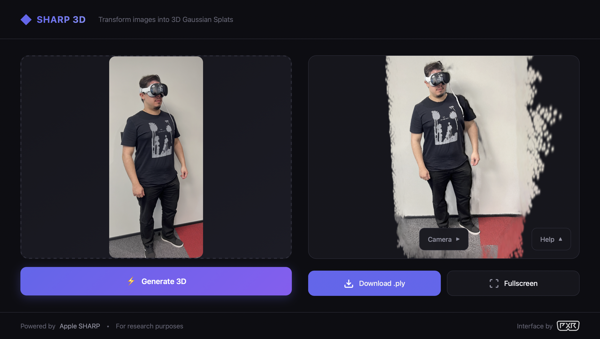

# 🎯 ML-SHARP Web Interface

Interface web para transformar imagens 2D em modelos 3D Gaussian Splats usando o [ml-sharp da Apple](https://github.com/apple/ml-sharp).



## ✨ Funcionalidades

* 📷 **Upload de imagens** - Arraste e solte ou clique para selecionar
* 🧠 **Processamento com ml-sharp** - Usa o modelo da Apple para gerar Gaussian Splats
* 🎮 **Visualização 3D interativa** - Rotacione, zoom e navegue pelo modelo
* 📁 **Upload de arquivos .ply** - Visualize modelos 3D já gerados
* 🖥️ **Modo tela cheia** - Visualize em tela cheia
* 🎛️ **Controles de câmera** - Posições predefinidas (Front, Back, Left, Right, Top)

## 📋 Requisitos

* **macOS** (Apple Silicon recomendado)
* **Python 3.10+** (recomendado: 3.11)
* **Node.js 18+**
* **Git**
* **8GB+ RAM** (16GB recomendado)

## 🚀 Instalação

### 1. Clone este repositório

```bash
git clone https://github.com/RodrigoMulinarioRamos/ml-sharp-web-interface.git
cd ml-sharp-web-interface
```

### 2. Execute o script de instalação

```bash
chmod +x install.sh
./install.sh
```

### 3. Inicie os servidores

```bash
./start.sh
```

### 4. Acesse a interface

Abra no navegador: **http://localhost:5173**

---

<details>
<summary><h2>📖 Instalação Manual (Passo a Passo)</h2></summary>

### 1. Clone o ml-sharp da Apple

```bash
git clone https://github.com/apple/ml-sharp.git
```

### 2. Crie um ambiente virtual Python

```bash
python3.11 -m venv venv
source venv/bin/activate
```

### 3. Instale as dependências Python

```bash
pip install --upgrade pip
cd ml-sharp
pip install -r requirements.txt
cd ..
pip install flask flask-cors werkzeug
```

### 4. Configure o Frontend

```bash
cd web/frontend
npm install
npm install @mkkellogg/gaussian-splats-3d three
cd ../..
```

### 5. Inicie os servidores

**Terminal 1 (Backend):**

```bash
source venv/bin/activate
cd web/backend && python app.py
```

**Terminal 2 (Frontend):**

```bash
cd web/frontend && npm run dev
```

</details>

---

## 🎮 Como Usar

1. **Arraste uma imagem** para a área de upload (ou clique para selecionar)
2. **Clique em "Generate 3D"** para processar
3. Aguarde o processamento (10s-2min dependendo do hardware)
4. O modelo 3D aparecerá no visualizador
5. Use o mouse para interagir:
   - **Clique esquerdo + arrastar** = Rotacionar
   - **Scroll** = Zoom
   - **Clique direito + arrastar** = Pan

### Carregar arquivos .ply existentes

Você também pode arrastar um arquivo `.ply` diretamente no visualizador 3D para visualizar modelos já gerados.

## ⚡ Performance

| Hardware | Tempo por imagem |
| --- | --- |
| CPU apenas | 1-2 minutos |
| Apple Silicon (MPS) | 20-60 segundos |
| NVIDIA GPU (CUDA) | 10-30 segundos |

> **Nota:** Na primeira execução, o modelo (~2.6GB) será baixado automaticamente. Isso pode demorar alguns minutos.

## 🔧 Solução de Problemas

<details>
<summary><b>Porta 5000 em uso (Mac)</b></summary>

No Mac, a porta 5000 é usada pelo AirPlay. O projeto já usa a porta 5001 por padrão.

Se ainda tiver problemas:

```bash
# Desativar AirPlay Receiver
# Sistema > Configurações > Geral > AirDrop e Handoff > AirPlay Receiver (desativar)
```
</details>

<details>
<summary><b>Comando 'sharp' não encontrado</b></summary>

Certifique-se de que o ambiente virtual está ativado:

```bash
source venv/bin/activate
```
</details>

<details>
<summary><b>Erro de memória</b></summary>

O modelo usa bastante RAM. Feche outros programas e tente novamente.
</details>

<details>
<summary><b>Python 3.10+ não encontrado (Mac)</b></summary>

Instale via Homebrew:

```bash
brew install python@3.11
```
</details>

## 📁 Estrutura do Projeto

```
ml-sharp-web-interface/
├── ml-sharp/              # Repositório da Apple (clonado)
├── web/
│   ├── backend/           # Servidor Flask
│   │   └── app.py
│   └── frontend/          # Interface React
│       └── src/
│           ├── App.jsx
│           ├── App.css
│           └── index.css
├── uploads/               # Imagens enviadas
├── outputs/               # Arquivos .ply gerados
├── install.sh             # Script de instalação
└── start.sh               # Script para iniciar
```

## 📚 Créditos

* [Apple ML-SHARP](https://github.com/apple/ml-sharp) - Modelo de geração de Gaussian Splats
* [Gaussian Splats 3D](https://github.com/mkkellogg/GaussianSplats3D) - Biblioteca de visualização

## 📝 Licença

Este projeto é apenas uma interface para o ml-sharp da Apple. Consulte as licenças originais:

* [LICENSE (ml-sharp)](https://github.com/apple/ml-sharp/blob/main/LICENSE)
* [LICENSE_MODEL](https://github.com/apple/ml-sharp/blob/main/LICENSE_MODEL)

## 🎬 Tutorial em Vídeo

[Link para o tutorial no YouTube]

---

**Powered by Apple SHARP • For research purposes | Interface by PXR**
